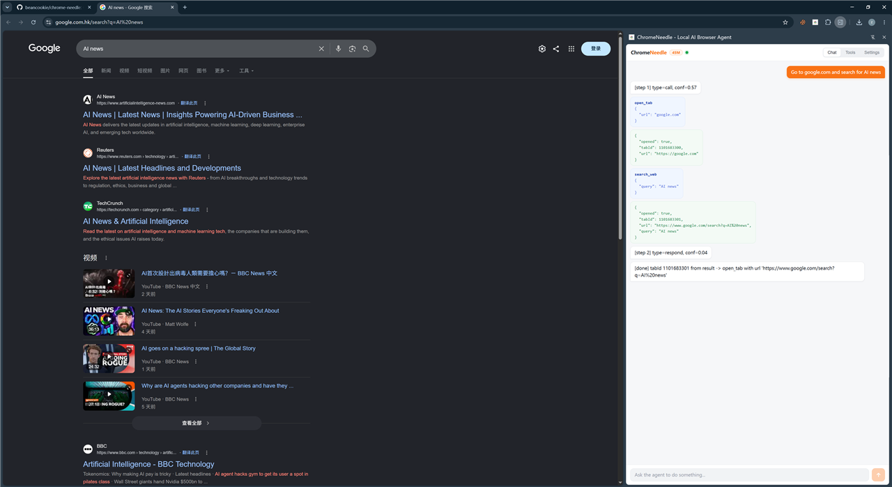
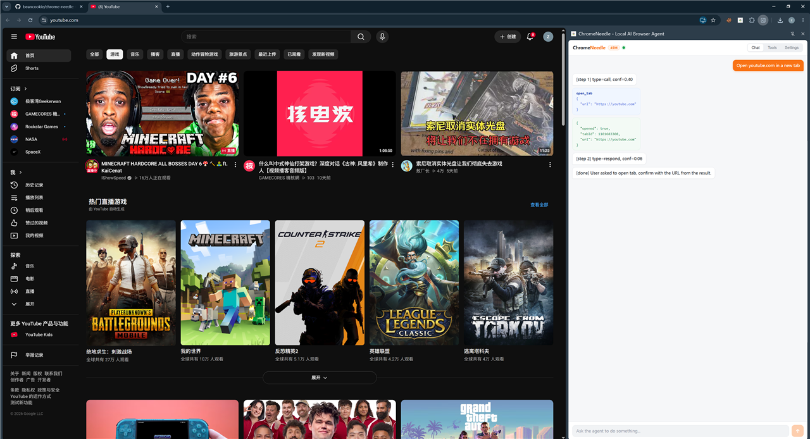

# ChromeNeedle - Local AI Browser Agent

A Chrome browser extension powered by [Needle 2](https://huggingface.co/Cactus-Compute/needle2) (45M parameter LLM), running entirely in local WASM.

## Features

- **18 built-in browser tools** — page reading, clicking, form filling, tab management, bookmarks, screenshots, notifications, clipboard, HTTP requests, custom scripts (5 exposed to model as Schema)
- **Chinese input support** — auto Chinese→English translation via iciba API
- **Custom script tools** — visual editor for writing your own JS tool functions
- **Fully offline** — model engine + weights bundled locally, no network needed after first load
- **Confidence scoring** — each tool call includes a confidence score

## Installation

Download: [chrome-needle.zip](https://github.com/beancookie/chrome-needle/releases/latest/download/chrome-needle.zip)

1. Open Chrome → `chrome://extensions/`
2. Enable "Developer mode"
3. Click "Load unpacked"
4. Select the unzipped project folder

## Usage Examples




**Basic navigation**
```
You: Go to google.com and search for AI news
AI: [tab.goto] ✓ → [tab.fill] ✓ → [tab.submit] ✓ (confidence: 0.91)
```

**Multi-tab operations**
```
You: Open youtube.com in a new tab
AI: [tab.new] ✓ Tab #4 created and navigated to youtube.com (confidence: 0.94)
```

**Form filling**
```
You: Fill this form with random test data and submit
AI: [tab.read] ✓ Found 5 fields → [tab.fill] ✓ → Ask: Confirm submit? y/n
```

## Project Structure

```
├── lib/                        # Model files (needle.js + needle.wasm + needle2.cact)
├── js/                         # Frontend logic
│   ├── sidepanel.js            # Main UI + Agent loop
│   ├── needle-agent.js         # WASM model loading & inference
│   ├── tools-builtin.js        # Built-in browser tools (schema + execution)
│   ├── tools-editor.js         # Custom script editor
│   ├── translator.js           # Chinese→English translation (iciba API)
│   ├── store.js                # chrome.storage persistence
│   └── utils.js                # Shared utility functions
├── css/style.css               # UI styles
├── icons/                      # Extension icons
├── manifest.json               # Chrome extension config
├── background.js               # Service Worker (tool backend)
├── content.js                  # Content Script
├── popup.html                  # Popup page
├── popup.js                    # Popup logic
└── sidepanel.html              # Side panel (main entry)
```

## Tech Stack

- **Inference engine**: Cactus Compute Needle 2 (C++ → WebAssembly)
- **Model size**: 13MB `.cact` + 307KB WASM engine
- **Memory usage**: ~28MB runtime
- **UI**: Vanilla JS + CSS Custom Properties (light theme)
